# Home Assistant Keypad

A 9-key macro keypad for Home Assistant, running ESPHome. Every key is RGB backlit, and comes in
two variants: one that sits on a desk and one that mounts on a wall, with magnets or screws.

Desk variant:

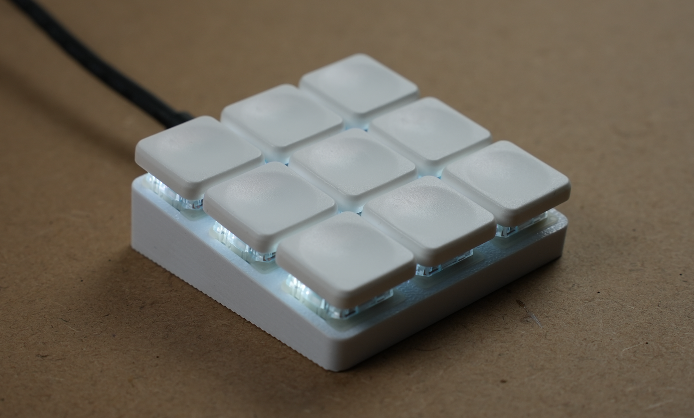

Wall variant:

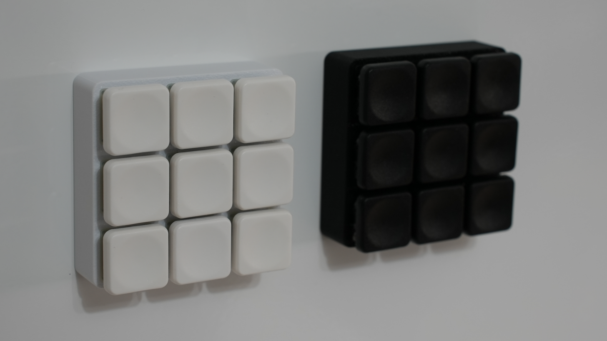

## Discord

Join the Discord if you want to follow along or ask questions: https://discord.gg/4yMsHbQQGn

## Waitlist

Want a pre-assembled one instead of building it yourself? Join the waitlist:
https://keypad.alex-labs.dev

## How to build it

### Tools required

- FDM 3D printer
- Soldering iron
- Phillips screwdriver
- 8 mm hollow gasket punch (wall variant only)
- Flush cutters

### Order components

The part names link to a search, so you can pick whichever shop you prefer.

| Part | Qty |
| --- | --- |
| [Gateron KS-33 low profile switches](https://www.google.com/search?q=Gateron+KS-33+low+profile+switch) | 9 |
| [Low profile keycaps](https://www.google.com/search?q=Gateron+KS-33+low+profile+keycaps) | 9 |
| [Seeed Studio XIAO ESP32C6](https://www.google.com/search?q=Seeed+Studio+XIAO+ESP32C6) | 1 |
| [SK6812MINI-E RGB LED, 3 mA](https://www.google.com/search?q=SK6812MINI-E+RGB+LED+3mA) | 9 |
| [74AHCT1G125GW,125 level shifter](https://www.google.com/search?q=74AHCT1G125GW%2C125) | 1 |
| [Ceramic capacitor 100 nF 50 V, 0805](https://www.google.com/search?q=ceramic+capacitor+100nF+50V+0805) | 10 |
| [Resistor 330 Ω, 0805](https://www.google.com/search?q=resistor+330+ohm+0805+SMD) | 1 |
| [M2 × 3 × 3 mm heat-set threaded inserts](https://www.google.com/search?q=M2+3x3mm+heat+set+threaded+insert) | 4 |
| [M2 × 6 mm countersunk Phillips screws](https://www.google.com/search?q=M2+6mm+countersunk+phillips+screw) | 4 |

For the wall-mounted variant you also need:

| Part | Qty |
| --- | --- |
| [Self-adhesive silicone rubber sheet, 1 mm](https://www.google.com/search?q=self+adhesive+silicone+rubber+sheet+1mm) | 1 |
| [Disc magnet Ø 10 mm, height 3 mm](https://www.google.com/search?q=disc+magnet+10mm+x+3mm) | 4 |

The keycaps I used are [these ones](https://nl.aliexpress.com/item/1005011938286189.html), variants
`B-A1 V2` and `W-A2 V2`.

The XIAO usually ships with pin headers. You need two 7-pin strips, so keep them.

### Order PCB

The board is 53 × 53 mm, 2 layers. Any fab house will work, but these instructions are for JLCPCB.

1. Download `gerber.zip`. Don't unzip it.
2. Go to [jlcpcb.com](https://jlcpcb.com), click **Order now** / **Add gerber file** and upload
   the zip.
3. Set the options below. Anything not listed is already correct at its default, leave it alone.
4. Save to cart and pick a shipping method at checkout.

| Option | Setting |
| --- | --- |
| Base Material | FR-4 |
| Layers | 2 |
| Dimensions | 53 × 53 (filled in automatically) |
| PCB Qty | 5 |
| Different Design | 1 |
| Delivery Format | Single PCB |
| PCB Thickness | 1.6 mm |
| Material Type | FR4 TG135 |
| Surface Finish | HASL (with lead) or Lead Free |
| Outer Copper Weight | 1 oz |
| Via Covering | Tented |
| Min via hole size | 0.3 mm / (0.4/0.45 mm) |
| Board Outline Tolerance | ±0.2 mm (Regular) |
| High-spec Options | leave as-is (all "No") |

Notes:

- 5 boards is the minimum order. You only need one, so you will have spares.
- Colour and silkscreen are cosmetic. Green is the fastest to produce.

### Print the enclosure

The STL files are in the `enclosure` folder. Pick `desk` or `wall` depending on the variant you
want. The wall variant also needs 4 magnet plugs.

I included an OrcaSlicer project with all the parameters already set:
`enclosure/keypad-orca-slicer.3mf`. It contains both variants, so disable the parts you don't need
before slicing.

The parts are designed to be printed in this orientation. Nothing needs supports.

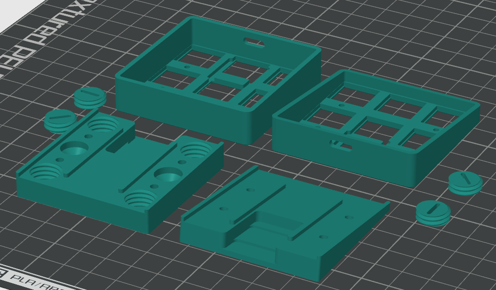

My settings:

| | |
| --- | --- |
| Printer | Bambu Lab P1S, 0.4 mm nozzle |
| Process | 0.16mm High Quality @BBL X1C |
| Filament | PLA |
| Build plate | Textured PEI |

If you slice the STL files yourself instead, these are the settings that matter:

| Setting | Value |
| --- | --- |
| Layer height | 0.16 mm (0.2 mm first layer) |
| Wall loops | 3 |
| Top / bottom shell layers | 6 / 4 |
| Sparse infill | 25%, rectilinear |
| Nozzle temperature | 220 °C |
| Bed temperature | 55 °C |
| Supports | off |
| Elephant foot compensation | 0.15 mm |

**IMPORTANT:** the top plates and the magnet plugs print at 100% infill, the bottom parts stay
at 25%.

Tolerances are tight. If the board doesn't drop into the top shell, your parts have most likely
shrunk. Scale them up a little, start with 100.5%, and reprint. In my case the original scale
worked fine.

### PCB assembly

**Do this in exactly this order.**

#### 1. Solder all the SMD components on the PCB

All the SMD parts go on the front side of the board, the switches go on the back later. The photos
below show where each part sits.

9 × SK6812MINI-E LED:

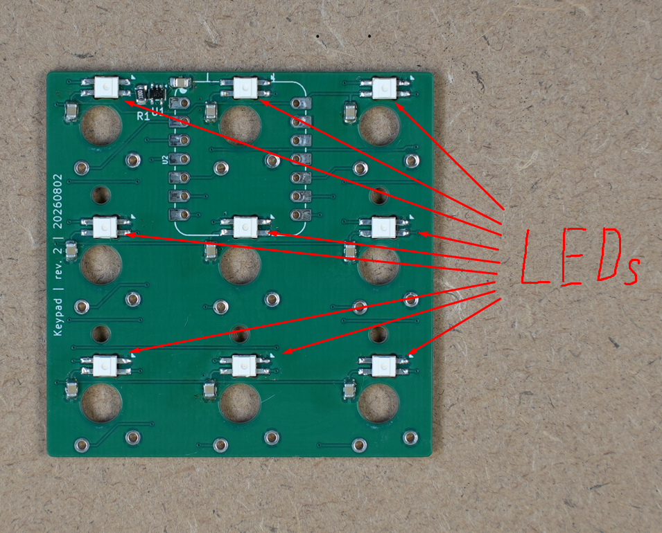

**IMPORTANT:** the LEDs go in one orientation only. The package has one corner cut at an angle, and
the board has a small triangle printed next to every LED footprint. The cut corner points at the
triangle. All 9 LEDs face the same way, so before you solder, check that all nine cut corners point
in the same direction.

The LEDs are daisy chained, so a single LED turned the wrong way breaks the chain: that one and
every LED after it stay dark.

10 × 100 nF capacitor:

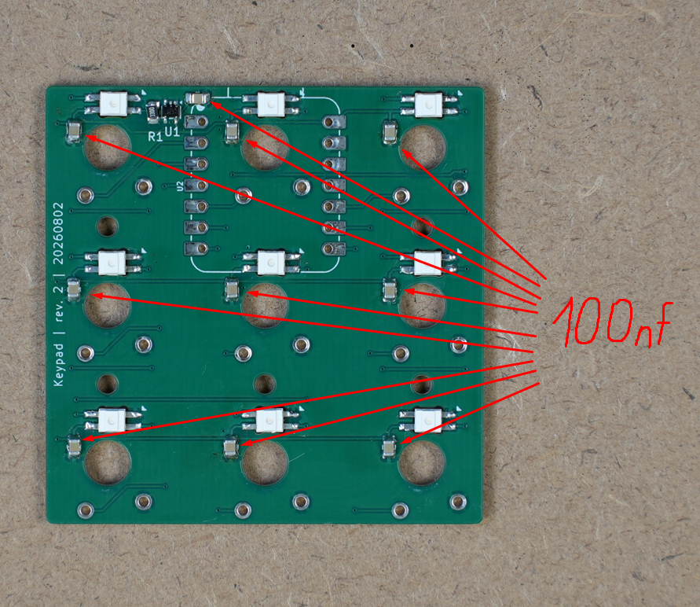

R1 (330 Ω) and U1 (74AHCT1G125GW), both in the top left corner:

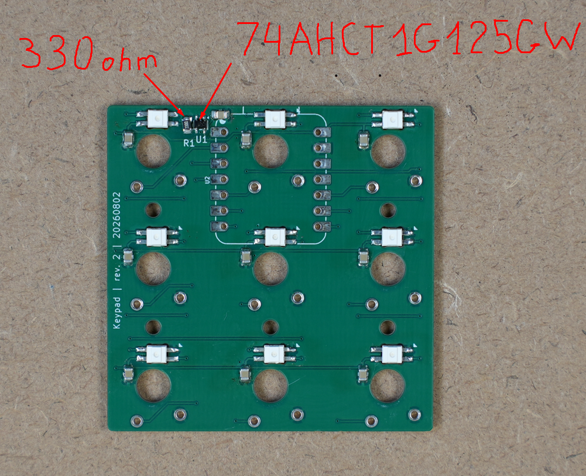

#### 2. Solder the two pin headers

Put the two 7-pin headers into the U2 footprint from the front, pins pointing up, and solder them
from the back.

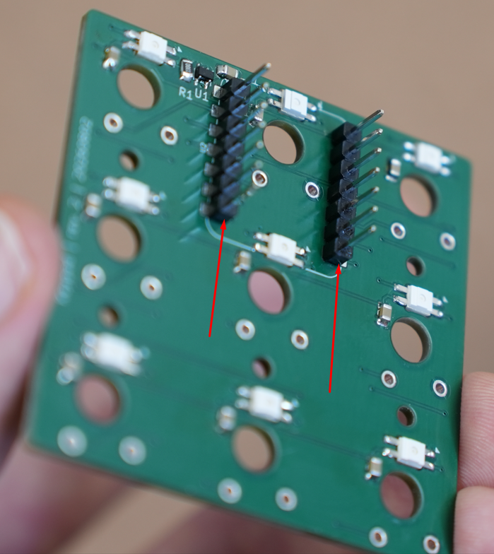

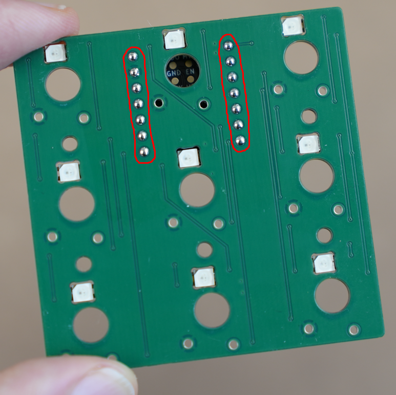

**IMPORTANT:** solder the headers to the PCB only. Don't solder the XIAO module onto them yet, it
goes on in step 4.

#### 3. Solder the switches

**IMPORTANT:** install all the switches in the top shell first, then put the PCB in the shell and
solder them in place.

Press all 9 switches into the top shell from the inside until they click:

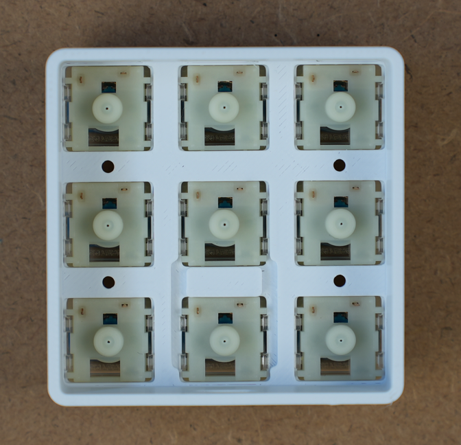

Then drop the PCB onto the switch pins, SMD side up. Each switch has two pins that come through the
board, so solder all 18:

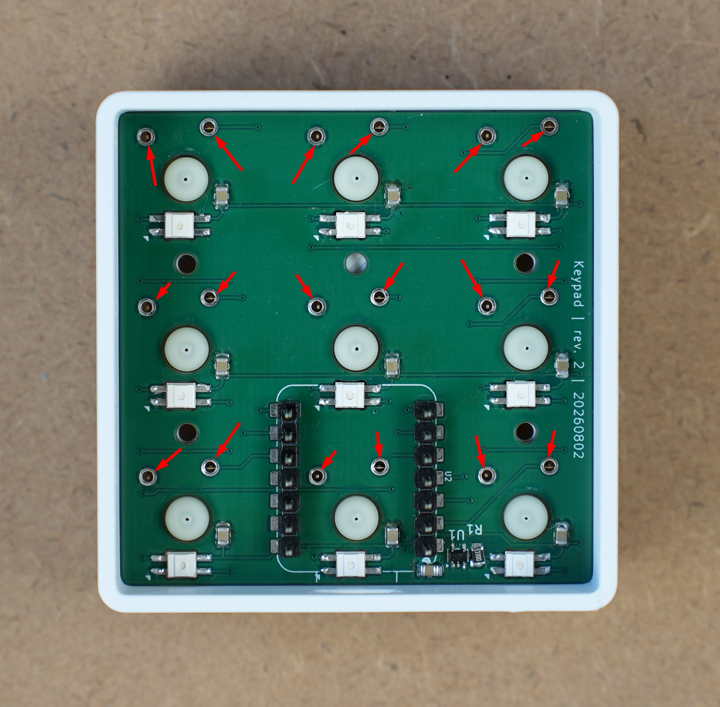

#### 4. Solder the controller module

Push the XIAO onto the two headers, with the USB-C connector pointing at the slot in the shell wall,
and solder both rows, 14 joints. Trim the header pins with the flush cutters.

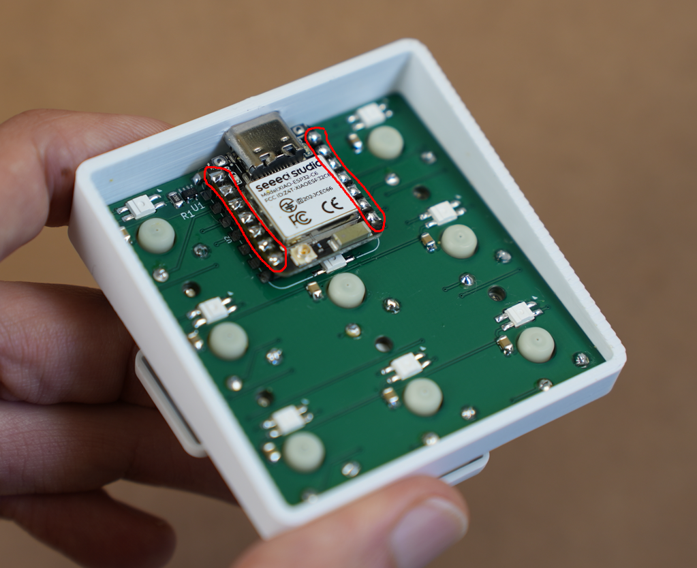

### Assemble the enclosure

#### Desk variant

The desk variant is the simplest one. Press the heat-set inserts into the four holes. A soldering
iron with a conical tip works well for this.

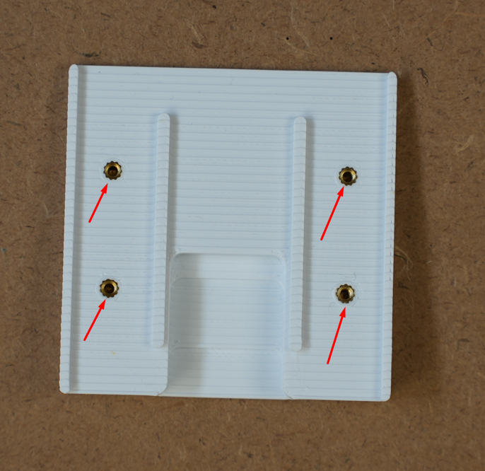

Then screw the top and bottom parts together with the 4 screws. They go in from the front, between
the switches.

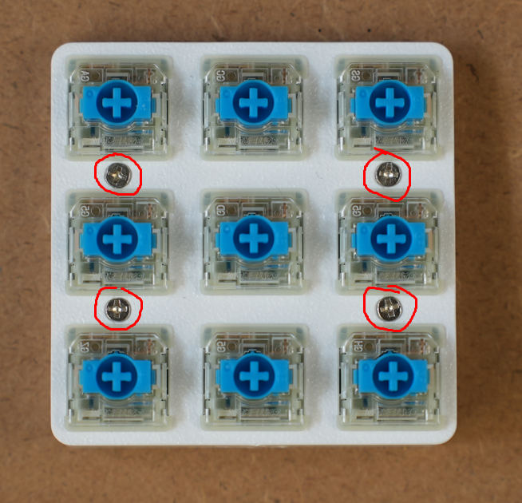

Install the keycaps and it's done!

#### Wall variant

The wall variant uses the same inserts and the same 4 screws to hold the two parts together. On top
of that it has 4 beds for the magnets and 4 printed caps that hold the magnets in place.

The beds are the corner holes. The 2 smaller holes in the middle are for the wall screws.

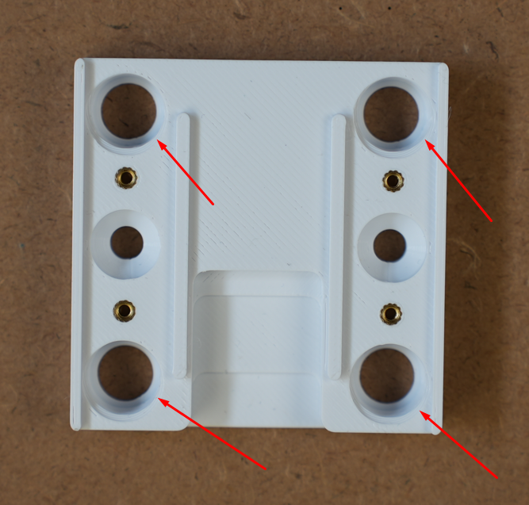

Put the magnets in place and screw the caps in. The caps have a slot, so a flat screwdriver works.

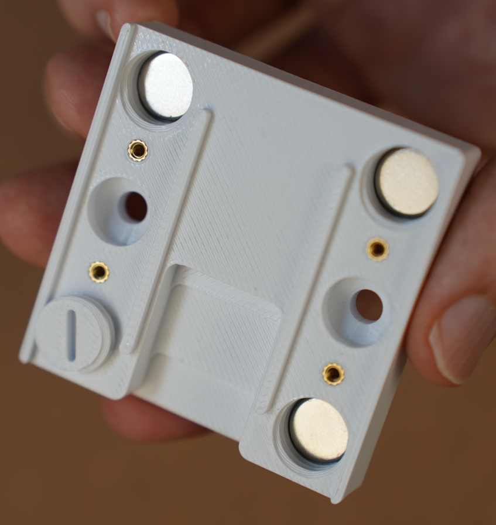

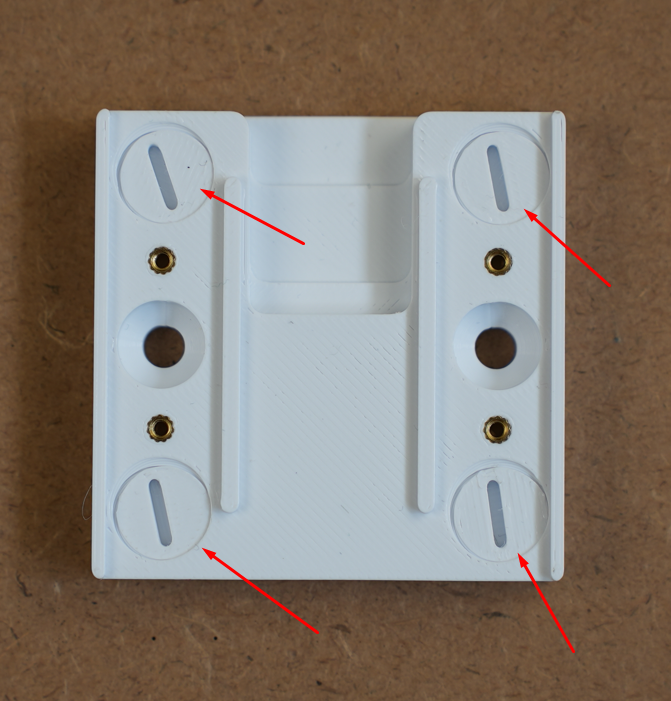

Finally, add the silicone rubber pads on the other side. Punch them out of the silicone sheet with
the 8 mm gasket punch.

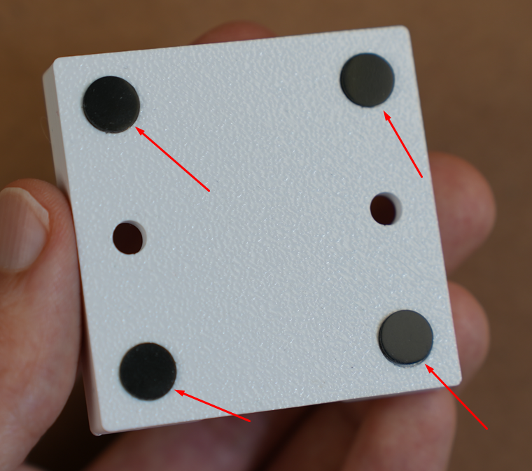

### Build and flash ESPHome

ESPHome is a tool that turns a YAML file into firmware for ESP32 boards, no coding needed.
`esphome.yaml` in this repo is not a whole config, it is only the part that describes the 9 keys and
the 9 LEDs. You paste it under the config ESPHome writes for you.

1. In Home Assistant go to **Settings → Add-ons → Add-on store**, install **ESPHome Device
   Builder**, start it and open it.
2. Press **+ New device**, call it `keypad` and pick **Seeed Studio XIAO ESP32C6**. It asks for your
   wifi once and remembers it.
3. Open the new device with **Edit**, put the cursor at the very bottom and paste the whole contents
   of `esphome.yaml` there. Change nothing above it: the generated API key, OTA and wifi blocks are
   yours, and the file doesn't touch them. See below for what you should end up with.
4. Plug the keypad into your computer with a USB-C cable, press **Install** and choose **Plug into
   the computer running ESPHome Device Builder**. Later updates go over wifi, no cable needed.
5. Home Assistant finds the keypad by itself. Go to **Settings → Devices & services** and confirm
   it.

This is what the wizard writes in step 2. Your name, key and hotspot password will be different.
Leave all of it alone and paste at the bottom:

```yaml
esphome:
  name: keypad
  friendly_name: keypad

esp32:
  variant: esp32c6
  flash_size: 4MB
  framework:
    type: esp-idf

logger:

api:
  encryption:
    key: "the key generated for you, don't share it"

ota:
  - platform: esphome

wifi:
  ssid: !secret wifi_ssid
  password: !secret wifi_password
  ap:
    ssid: keypad Fallback Hotspot
    password: "the password generated for you"

captive_portal:

# ---> everything in esphome.yaml goes here, from this line down <---
```

You get 18 entities:

| Entity | What it does |
| --- | --- |
| Key 1 … Key 9 | fires `press` or `long_press` |
| LED 1 … LED 9 | RGB light, one per key |

In an automation, trigger on a key entity and branch on its `event_type` attribute. The hold time is
1 second; change `long_press_ms` at the top of the config to adjust it.

## License

[CC BY-NC-SA 4.0](https://creativecommons.org/licenses/by-nc-sa/4.0/). Build it, modify it, share
it, but not commercially, and credit the original. See [LICENSE](LICENSE) for the details and for
the third-party footprint libraries used in the KiCad project.
